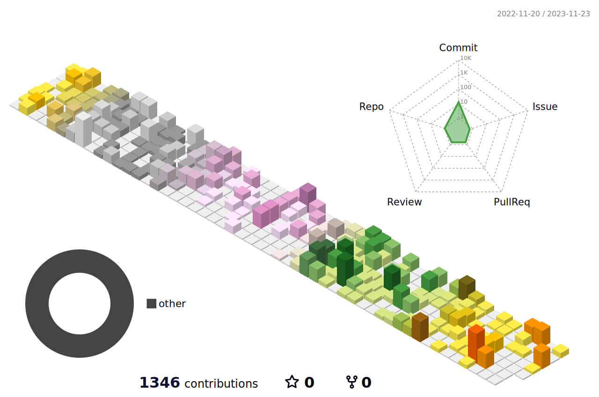

<!---
BetaXue/BetaXue is a ✨ special ✨ repository because its `README.md` (this file) appears on your GitHub profile.
You can click the Preview link to take a look at your changes.
--->

# 🚀 关于我
- 👋 Hi, I’m @BetaXue
- 👀 I’m interested in Java, C++ and all that kind of stuffs
- 🌱 I’m currently learning and contributing to the Lansintech project

 

 

## 访问量： 

