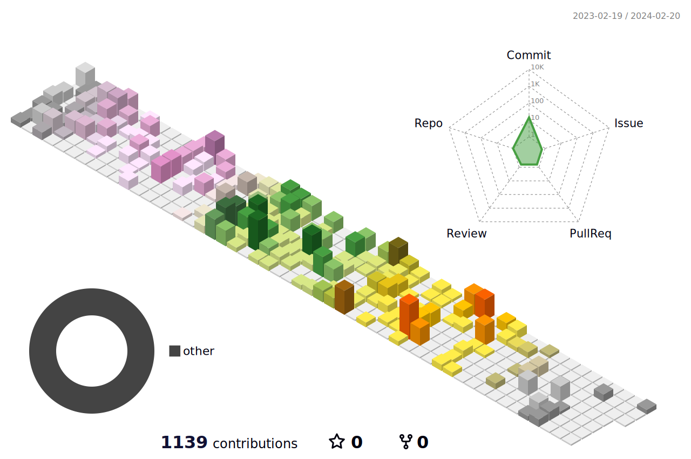

<!---
BetaXue/BetaXue is a ✨ special ✨ repository because its `README.md` (this file) appears on your GitHub profile.
You can click the Preview link to take a look at your changes.
--->

<a align="center" href="https://github.com/betaxue">

<!--    -->
  

   

  - 👋 Hi, I’m @BetaXue
  - 👀 I’m interested in Java, C++ and all that kind of stuffs
  - 🌱 I’m currently learning and contributing to the Lansintech project
  - 🚀 [Spring](https://github.com/spring/spring) enthusiast
</a>

 

## 访问量： 

